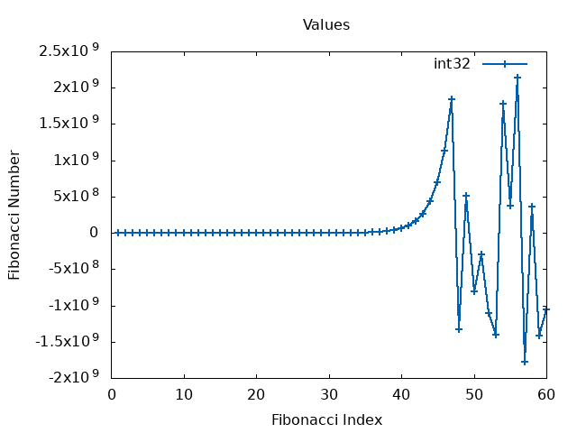
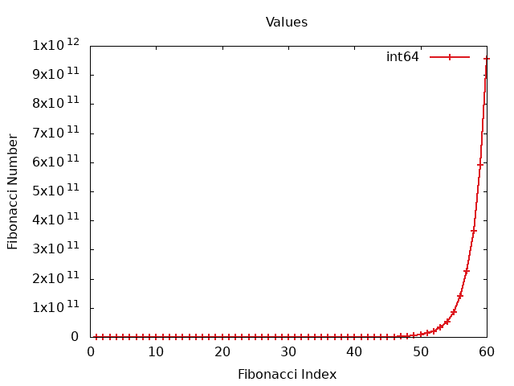

# Aufgabe 3
Die Laufzeit der beiden Ansäze kann man gut im Graphen beobachten. Das rekursive Programm wächst quadratisch, das Iterative Programm nur linear.

Bei den Datentypen kann man sehen, das der 32 Bit lange Integer Typ ab ca. 45 falsche werte liefert, da der Speicherplatz für die Zahl zu klein wird. Ein Overflow entsteht und die Zahl läuft vom negativen Ende wieder herrein.  
Der Plot vom 64 Bit langen Datentyp hingegen wächst normal weiter, da noch genug Platz zum speichern der Zahl vorhanden ist.

Wie groß ein `long int` ist, ist abhängig vom System. `long long int` ist immer 64 Bit lang. [(Referenz)](https://en.cppreference.com/w/cpp/language/types)  
Bei den Datentypen `int32_t` und `int64_t` ist man immer sicher.

