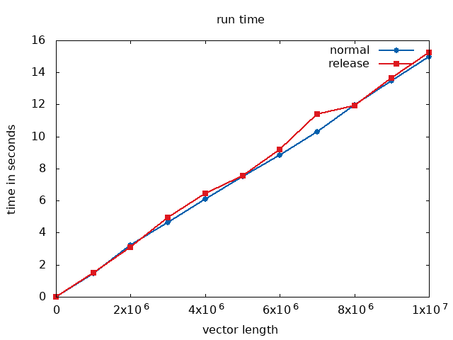

# Aufgabe 2

[https://github.com/catchorg/Catch2](https://github.com/catchorg/Catch2) Mit catch2 kann man einfacher komplexe tests schreiben. Das ganze geht über includes von c++ und benötigt daher keine installation weiterer Software.

## laufzeit von debug vs. release

